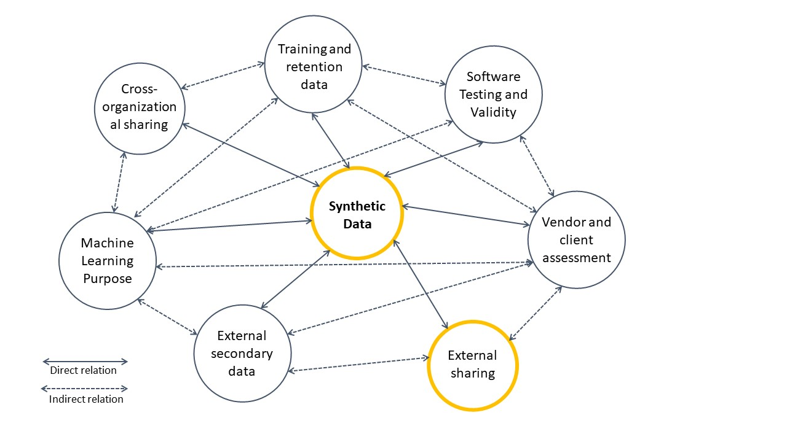

# Scaling Machine Learning Systems with Synthetic Data #

- Wouldn't it be great to have access to large pool of quality data to increase organizational competitiveness and innovations using AI?

- What if you can improve utility of data by sharing it with  business partners and governement without privacy concerns while improving collaboration and building trust?

- What if you monitize on new products and services by synthesizing real time customer data without compromising personal information?

- The answer to questions above is Synthetic data, a method to statistically generate artificial data using simulations, to meet specific organisational needs while improving data utility, data parivacy and protection.

 
 
 
  
 
 
 

The benefits of implementing AI in finance is monumnetal from chatbot assistants to fraud detection and task automation help streamline processes and therefore vastly improve customer experience. Aggregated potential cost savings for banks from AI applications is estimated at [$447 billion by 2023](https://www.businessinsider.com/ai-in-banking-report?r=US&IR=T) combined in front and back office.

The benefits in Financial Services is increasingly underpinned by technological advances in AI and Machine Learning, big data and cloud infrastructure. According to the [Global Survey on AI in Financial Services](https://www.jbs.cam.ac.uk/faculty-research/centres/alternative-finance/publications/transforming-paradigms/), 77% of respondents believe AI will be of high or very high overall relevance to their organisations playing a key role in product development and revenue creation, process automation, risk management, effective customer support and client acquisition. In all deployment use cases, the respondents noted that the Machine Learning and AI's biggest impact will yield from greater accuracy of model and scalability of the AI model.

Despite the growth of in adaptation of AI, there are considerable barriers to overcome. Quality of data used to train a model is seen as the biggest hurdle in AI implementation in addition to the sub issues including data collection and data imbalance. Data confidentiality and data regulation is also causing bottleneck situation limiting utility of data. This is because often organisations have to put in extra resources on time consuming activities such as data acquisition and data cleansing. Furthermore, nearly [83% of respondents](https://www.jbs.cam.ac.uk/faculty-research/centres/alternative-finance/publications/transforming-paradigms/) perceive the regulation around sharing customer information or data between jurisdiction to be significnatly problematic for their investment in AI.

This has hilighted an urgency in need to optimize data utility and sharing data using innovative privacy enhancing technologies.

## What is synthetic data?

**Synthetic data** is created artificially, mimicking appropriate statistical distributions and mathematical properties of real-world data. It is a form of data augmentation practice can be used across a range of activities including training, validation, evaluation of a model or for testing a new product.  

  
  <figcaption> figure1: Synthetic data use: Optimising data utility</figcaption>

## Machine learning models and reproducibility

The accuracy and performance matrices generated by Machine Learning models depend on the statistical relationship between the input data. Often methods used for data aggregation coupled with sampling size and random noise can distort statistical relationship between the variables impacting on model performance, which may erode trust in processes.

Reproducibility of the model outcome is also an important measure. An outcome of a machine learning model is reproducible if one can fully replicate the exact model output, which is critical in order to develop algorithms to reliably solve complex tasks at scale, with limited or no human supervision [2]. In research intensive industries use of synthetic data has helped researchers not only in dealing with issues around sampling size and data imbalance but also improve the reproducibility and predictive performance of AI models by ensuring complete sepeartion of training and evaluation datasets [3].

For example in cyber security,  Intrusion Detection Systems(IDS) is often implemented in order to quickly identify and produce timely response to attacks on the computer network. AI is widely used in design and implementation of such system. The algorithm is typically trained to predict users' behaviour, using multiclass classification and clustering techniques, to differenciate unusual pattern from the normal one. Data on past attacks is rarely shared outside organisational boundries due to privacy and reputational concerns. Therefore, lack of training data makes it nearlly impossible to train IDS such that it detects unforeseen future events. Furthermore, an algorithm trained on such imbalanced dataset often risk generating higher false positives and/or false negatives which may result in customer dissatisfaction. 

A research experiement in IDS shows that synthetic data samples generated using sophisticated technique Conditional Generative Adversarial Network (CTGAN) can balance training samples, using both actuals and a wide range of simulations, can increase prediction accuracy by as much as 8% [4].

## External, Secondary data

## Vendor and client assessment

## Software testing

## Training and retention data

## Cross organizational sharing

## External Sharing

## Synthetic data properties

## Advantages

Synthetic data has many advantages over real-world data:

Proven to be highly beneficial to scale and develop machine learning applications, synthetic data is a more cost-effective and less time-consuming option than real-world data.

**In the absence of real-world data:** Synthetic data can be generated to imitate scenarios that have never been seen before (e.g. in Reinforcement Learning). The data would be equally accessible to everyone, regardless of the size of business – and retaining integrity is a core value to us at EY.

**Compilance with data protection regulations:** Due to data protection laws and regulations (GDPR, CCPA, POPI, etc.), real data can be restrictive in its use – and the leash on Financial Services organisations has only tightened. Synthetic data overcomes this issue by generating an artificial dataset without disclosing confidential information from the original dataset.

**Zero threat to the privacy and security of real data:** Synthetic data lacks sensitive or personal information about real people. Especially important in financial services, where confidentiality of client data is extremely delicate, and leaks could lead to major legal and financial issues for the organisation. In 2014, a data breach at JP Morgan impacted 76 million users and was estimated to cost $100 million in fines for the company

**Accuracy and diversity of training data:** Synthetic data can generate more diverse and large datasets with higher labelling accuracy to train deep learning models. It is just as accurate and effective as real-world data (Nabati et al., 2020), despite being artificial. It is more scalable, flexible and faster to generate (Ramos & Subramanyam, 2021)

**Reducing bias:** Research by Gartner estimates that 85% of algorithms that are currently being used are erroneous due to inherent biases within datasets (Van der Meulen & McCall, 2018). Synthetic data in addition to replica dataset can help mitigate bias and imbalance in dataset.

**Targeting of edge-cases:** The adoption of synthetic data in security and computer vision systems aids in the accuracy of labelling and detecting edge-cases that would be otherwise expensive to obtain or endure. (Sayre M., 2019), (Datagen, 2021)

## How can you generate synthetic data?

**Data augmentation:**  used for accumulating data to train, validate and evaluate models covering a wide range of use-cases and unforeseen events. For instance,  Convolutional Neural Networks (CNN) or Generative Adversarial Networks (GANs) can be utilised to produce altered or augmented synthetic images and videos, as well as tabular data where data sequence and adjacency can be simulated dynamically  (Das A., 2020), (Dilmegani C., 2021).

**Synthetic environments for scenario planning:** an increasingly popular choice in reinforcement learning applications; for instance in toolkits such as OpenAi Gym –providing simulation environments to compare and develop unprecedented scenarios and edge-cases in both single and multi-agent context (Gulli, Kapoor & Pal, 2019).

## Examples

Think of clicinal trial management which would require a large cohort size from a wide range of demography and rigourous trials prior to scientific and medical acceptance. This process can be time consuming and legnthy as it will require both volume and variety of both clinical and real world data to conduct thorough statistical analysis. In addition to that hidden knowledge within the data collected adds further challenges.

## What is synthetic data and how is it used in finance?

## Methods of generating sysnthetic data

Methods to use to produce synthetic dataset and availability matrics to ensure robust quality of generated datasets.

## How Synthetic data is used in finance?

Think of clicinal trial management which would require a large cohort size from a wide range of demography and rigourous trials prior to scientific and medical acceptance. This process can be time consuming and legnthy as it will require both volume and variety of both clinical and real world data to conduct thorough statistical analysis. In addition to that hidden knowledge within the data collected adds further challenges.

Across industries there are several use cases where synthetic data has proven to be an advantage. How

As internet continues to grow in complexity and size with cloud computing and IoTs, network traffic anomalies are becoming diverse and quite common adding significant pressure to the security. Differenciating "normal" traffic behaviour from intential or unintential attack, fault or defect

Security - Regulation, Anonymity,

For examle Machine Learning algorithms are often used in fraud detection systems to classify legitimacy of financial transactions.

Scarcity of fraudulent instances makes the dataset used to train such models highly imbalance.

The value for business: Security, Agility, Scale, Reproducibility

innovation : security, Agility and scale

regulatory compliance : security, reproducibility, scale

- humans at center
- technology at speed
- innovating at scale

Refs:
[A BasisEvolution framework for network traffic anomaly detection](https://www.sciencedirect.com/science/article/abs/pii/S1389128618300331)

[Money Laundering Detection using Synthetic Dat](https://www.diva-portal.org/smash/get/diva2:834701/FULLTEXT01.pdf)

[A Copula based Framework for Generating Synthetic Data from Aggregated Sources](https://ieeexplore.ieee.org/abstract/document/9346329)

[2] [Reproducibility in Machine Learning for Health](https://openreview.net/pdf?id=HylgS2IpLN)

[3] [Synthetic data use: Medical trial example](https://link.springer.com/article/10.1007/s44163-021-00016-y)

[4] [Effect of balancing data using synthetic data on the performance of machine learning classifiers for Intrusion Detection in Computer Networks](https://arxiv.org/pdf/2204.00144.pdf)