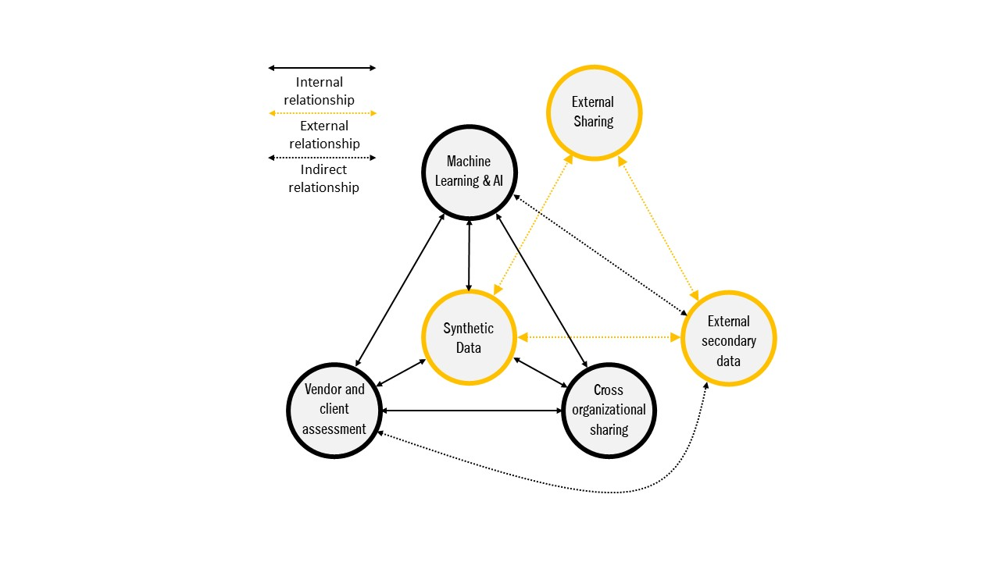
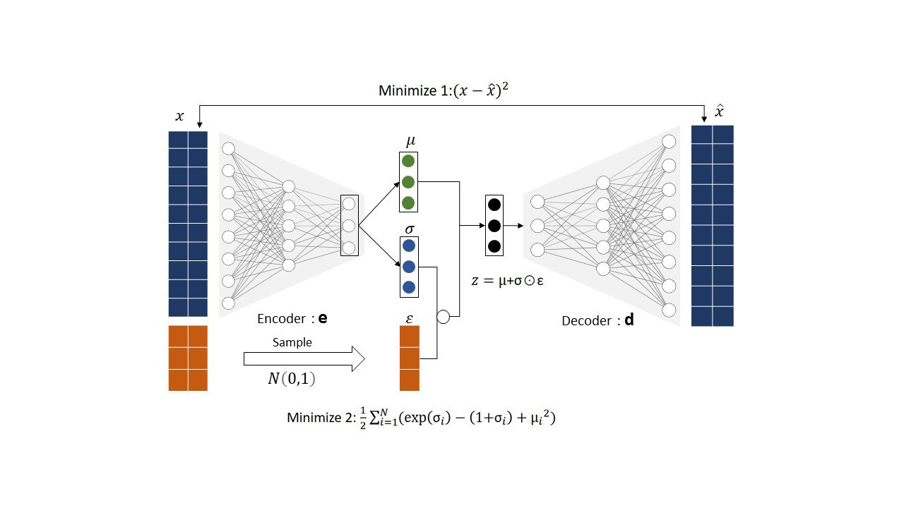
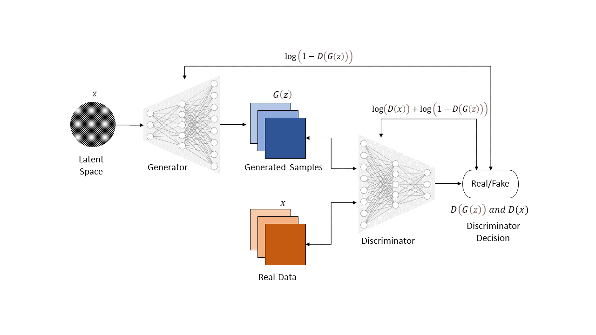
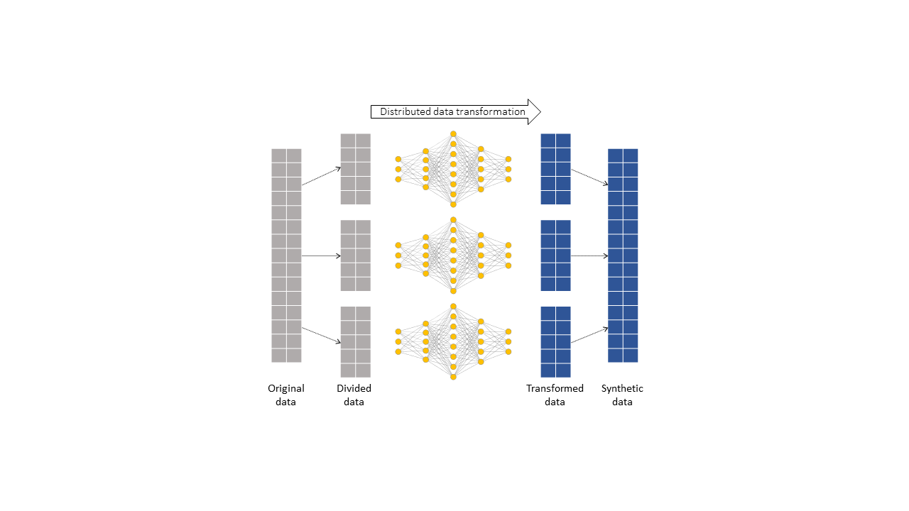

# Scaling Machine Learning Systems with Synthetic Data #

- Wouldn't it be great to have access to large pool of quality data to increase organizational competitiveness and innovations using AI?

- What if you can improve utility of data by sharing it with  trusted business partners and governement without privacy concerns while improving collaboration and building trust?

- What if you monitize on new products and services by synthesizing real time customer data without compromising privacy information? 

- The answer to questions above is Synthetic Data, a method to statistically generate artificial data using simulations to meet specific organizational needs while improving data utility for improved data parivacy and protection.

 
 
 
  
 
 
 

# Technology trend, 2022

The benefits of implementing Machine Learning systems in finance is monumnetal. The technological improvements in natural language processing, computer vision, and intelligent automation have helped many industries streamline their organisational processes and therefore vastly improve customer experience. By 2023, a potential cost saving of [$447 billion](https://www.businessinsider.com/ai-in-banking-report?r=US&IR=T) is estimated in banking alone from ML and AI applications.

The benefit to Financial Services is increasingly underpinned by technological advances in AI and Machine Learning systems, big data and cloud infrastructure. According to the [Global Survey on AI in Financial Services](https://www.jbs.cam.ac.uk/faculty-research/centres/alternative-finance/publications/transforming-paradigms/), 77% of respondents believe ML/AI systems will be of high or very high overall relevance to their organisations playing a key role in revenue creation by providing customer support leading to customer retention, client acquisition, risk management, process automation, and product development. In all deployment use cases, the respondents noted that the Machine Learning and AI's biggest impact will yield from greater model accuracy and scalability.

Despite the growth of AI, there are considerable barriers to overcome. Quality of data to train model is seen as the biggest hurdle in AI implementation in addition to sub issues including data collection and data imbalance. Data confidentiality and data privacy is also mildly perceived as causing bottleneck situation to AI implementation limiting utility of data. Often organisations have to put in extra resources on time consuming activities such as data cleaning. Nearly [83% of respondents](https://www.jbs.cam.ac.uk/faculty-research/centres/alternative-finance/publications/transforming-paradigms/) believe that regulation around cross-organisational data sharing of personal information between jurisdiction to be significnatly problematic for AI implementation. 

The above has hilighted urgency in need to optimize data utility and share data using innovative privacy enhancing technologies to prevent data sharing concerns. 

## What is synthetic data?

**Synthetic data** is created artificially, by mimicking mathematical properties such as statistical distribution, probability distribution of the real-world data. It is a form of data augmentation practice to generate balanced datasets. Synthetic data is used across a wide range of industries including financial services, government,  pharma, medical, and media and entertainment. The concept of augmenting data is widely used across a variety of industries to imitate real-world scenarios. In ML/AI context it has an important use case in training, validating, evaluating ML applications, for scaling up new services and products with speed and accuracy. 

Synthetic data is a privacy-enhancing technology and can be seen as a potential solution to financial services strugglig with privacy compliance and data access. A [study published by Gartner](https://www.gartner.com/en/doc/100-data-and-analytics-predictions-through-2025) predicts that by 2024, 60% of the data used for the development of AI and analytics solutions will be synthetically generated. Gartner is ranking Synthetic data as a [forward-looking privacy technology](https://www.gartner.com/document/3987903). MIT Technology Review describes Synthetic data as one of the [10 Breakthrough Technologies, 2022](https://www.technologyreview.com/2022/02/23/1045416/10-breakthrough-technologies-2022/#synthetic-data-for-ai).

 

    
  <figcaption> figure1: Synthetic data use: Optimising data utility</figcaption>

 

## Machine learning applications and reproducibility

The accuracy and performance matrices generated by ML models depend heavily on statistical relationship between the input data. Often methods used in data aggregation coupled with sampling size and random noise can distort this relationship between the variables resulting in poor performance, which may erode trust in processes.

A [research by Gartner](https://www.gartner.com/en/newsroom/press-releases/2018-02-13-gartner-says-nearly-half-of-cios-are-planning-to-deploy-artificial-intelligence) estimates that 85% of algorithms that are currently being used are erroneous due to inherent biases within datasets. Synthetic data in addition to replica dataset can help mitigate bias and imbalance in dataset.

Reproducibility is yet an important principle in scientific method used for validation process. An outcome of an ML model is reliable if one can fully reproduce the exact result. This is critical in order to develop algorithms to reliably solve complex tasks at scale, with limited or no human supervision [2]. In research intensive industries use of synthetic data has helped researchers not only in dealing with issues around sampling size and data imbalance but also improve the reproducibility and predictive performance of AI models by ensuring complete sepeartion of training and evaluation datasets [3].

For example in cyber security,  Intrusion Detection Systems(IDS) is widely used to quickly detect anomalies in computer network and produce timely response to a potential cyber attack. ML/AI algorithms are used at the core of such system. The algorithm uses multiclass classification and clustering techniques, to find anomalies in attacker's behaviour and differenciate unusual pattern from the normal one. Such data on past attacks is rarely shared outside organisational boundries due to privacy and reputational concerns. Therefore, lack of training data makes it nearlly impossible to train IDS such that it detects unforeseen future events and edge-cases. Furthermore, an algorithm trained on such statistically imbalanced dataset often risk generating higher false negatives.

A research experiement in IDS shows that synthetic data samples generated using sophisticated technique such as Conditional Generative Adversarial Network (CTGAN) can balance training samples, using both actuals and a wide range of simulations, can increase prediction accuracy by as much as 8% [4].

## External Sharing

Financial data - such as consumer transaction records, account payments, claims and underwritings is highly sensitive and subject to stringent data protection obligations and data privacy laws [5]. Synthetic data on the otherhand masks out sensitive or personal information about real people while preserving statistical relations. An important feature for financial services, where confidentiality of client data is extremely delicate, and leaks could lead to major legal and financial issues. For example, in 2014, a data breach at JP Morgan impacted 76 million users and was estimated to cost $100 million in fines for the company. 

_To add privacy preserving features_

Organisation wide implementation of effective synthetic data policies can help generate artificial data from original data without disclosing information outside the organisation. Then the data can be shared with the trusted business partners, and third party vendors for effective customer service. In financial services benefits of sharing is not limited to relying on third party credit report or analysing market sentiments but also in effective implementation of risk management framework to speed up client onboarding process while complying with KYC/AML regulations.

The Synthetic data can be shared internally and externally without much concern.

**Operational Benefits:**

* External, Secondary data

* Vendor and client assessment

* Software testing

* Training and retention data

* Cross organizational sharing

* Synthetic data properties

* Advantages

## How can you generate synthetic data?

[Model generation diagrams](https://www.statice.ai/post/how-generate-synthetic-data)

Data augmentation is often used for creating balanced data to train, validate and evaluate models covering a wide range of use-cases and unforeseen events. For instance,  Convolutional Neural Networks (CNN) or Generative Adversarial Networks (GANs) can be utilised to produce augmented synthetic images and videos. Whereas in structured data sequences can be generated dynamically using causation and correlation patterns found in original dataset(Das A., 2020), (Dilmegani C., 2021).

Synthetic environments for scenario planning is an increasingly popular choice in reinforcement learning applications. Synthetic data generated using [Reingforcement Learning](https://en.wikipedia.org/wiki/Reinforcement_learning) can simulate scenario that was never seen before. For instance toolkit such as OpenAI Gym provide simulation environments to model unprecedented scenarios and edge-cases in both single and multi-agent context (Gulli, Kapoor & Pal, 2019).

### Variation Autoencoder (VAE):

VAE belongs to a family of generative models which works with both supervised and unsupervised data. It uses probability to describe data distribution in the latent space. We input real data into the Encoder which outputs data in form of vectors belonging to a latent distribution. This vector is then fed to Decoder which reconstructs the data that was originally fed to the encoder. The system learns to optimises correlation between input and output of the data using iterativive optimisation process. 

### GAN

Generative Adverserial Networks(GAN) belongs to a family of deep learning models and is used to generate synthetic data, including tabular data, images, and sound/speech data.

GANs are used to generate synthetic data that mimics real data. This model includes a training process that involves pitting two neural networks, a Generator and a Discriminator, against each other. The Generator is used for generating synthetic data and the Discriminator's role is to distinguish between real and synthetic data. This is done in an iterative manner such that output of the overall model improves with number of iterations. In the paper ["Data Synthesis based on Generative Adversarial Networks"](http://www.vldb.org/pvldb/vol11/p1071-park.pdf), researchers have proposed table-GAN to synthesise tabular data by preserving statistical properties of the original data while minimizing information leakage. ML/AI models thereafter can be trained using synthetic data. 

When training a model with Synthetic data, often trade-off exists between the data privacy (information leakage) and the model accuracy. In other words, a higher privacy level leads to lower degree of model compatibility as statistical attributes of the synthetic data differ greatly when privacy levels are set high. This is an ever evolving areas of research but so far it has shown promising results in generating synthetic data. 

### Divide-and-Conquer

A divide-and-conquer approach works in three phases. Firstly, it splits the input data into several subsets recursively by leveraging parallelism. At this stage it takles each smaller subset while preserving linkages to the real data. And finally during the third phase, using algorithmic approach, it recursively synthesize the data until they formulate a solution of the original problem. This is a commonly used method and uses distributed computing techniques to produce synthetic data, both supervised and unsupervised, while applying various machine learning techniques such as clustering. 

# Use cases in Financial Services

## Insurance Usecase
**Insurance companies** are compelled to make most out of data they collect from users as a result of digitisation, intense competition and a new set of emerging risks. However, their ability to do so is constrained by strict privacy concerns, regulatory compliance, and legacy technology. Furthermore, regulatory developments such as [proposal to regulate AI systems](https://digital-strategy.ec.europa.eu/en/library/proposal-regulation-laying-down-harmonised-rules-artificial-intelligence) ,released by European Commission require fast adoptation from insurance players. Synthetic data can help insurers address some of their data processing challenges.

ML solutions have helped insurance companies in filling data gaps by generating synthetic data or by adopting federated learning across their ecosystem - a privacy enhancing technique. 

* **Product Development**: Identify, develop and tests customer-facing products and services at speed while complying with the strictest privacy framework.
* **Sales**: By enabling secure exchange of real-time information across ecosystem can improve user experience boosting customer conversion rate.
* **Underwriting**: Improve accuracy in underwriting process by modeling risks on balanced datasets with a greater control over statistical relations and data imbalance.
* **Contract Management**: Utility of data increases when a model is scaled up to infer large volume of data. With cloud technologies this can be achieved easily while setting effective governance policies and complying with such policies.
* **Claim Management**: Quickly identify relational and behavioural patterns of users in large volume of data to strengthen fraud detection and claims management. 

Synthetic insurance data is already being used by number of European insurers. [A swiss insurance company](https://www.swissre.com/risk-knowledge/advancing-societal-benefits-digitalisation/machine-intelligence-in-insurance.html) validated the use of synthetic data in the context of contact less transactions, adding a new tool to their digital transformation toolbox at enterprise level. The company evaluated the performance of ML viability directly by integrating(developing and running - ie. MLOps) and indirectly by assessing benefits and costs. 

Public authorities in Europe are also investing in synthetic data, like [Call for input: Synthetic data to support financial services innovation](https://www.fca.org.uk/publications/calls-input/call-input-synthetic-data-support-financial-services-innovation) by FCA in the U.K, [MAS](https://www.mas.gov.sg/news/media-releases/2022/mas-led-industry-consortium-publishes-assessment-methodologies-for-responsible-use-of-ai-by-financial-institutions) in singapore and Germany. And Gartner is ranking it as a [forward-looking privacy technology](https://www.gartner.com/document/3987903) for the coming years.

## Long term data retention - [**REFERENCE ONLY**]

"The finance sector has received more EU [GDPR fines](https://iapp.org/news/a/study-finance-sector-received-more-gdpr-fines-than-other-industries/#:~:text=A%20recent%20study%20published%20by,the%20processing%20of%20personal%20data.) than any other industry. Non-compliance does not only involve hard cost such as financial penalties in fines but also involves soft costs such as trust and reputational damage leading to revenue loss.

[A global survey](https://www.jbs.cam.ac.uk/faculty-research/centres/alternative-finance/publications/transforming-paradigms/) by EY and Cambridge University revealed that Risk management represneted the leading AI implementation area in early 2020, followed by the generation of revenue potential through new products and processes.  The survey also revealed of 'Technological Maturity' as one of the key concerns in AI implementation. Where legacy systems with proprietary formats and siloed IT infrastructures prevent data teams from quickly accessing the data. And where data is available the quality of data is the biggest concern. 

* **Transactional Analysis and Risk Monitoring** : High accuracy in transaction based time-series data can help banks reliably microsegement customers based on value at risk and prevent default.

* **Cybersecurity and the Zero-Trust Data Model**: Improving CyberSecurity in the age of Zero Trust cybersecurity requires upsampling of data in order to detect anomalies. Using synthetic data in high-performing AI system can help upsampling of data such that various unforeseen security issues can be addressed in a timely manner. 

* **Fraud Detection** : Fraud and money laundering operations are incredibly versatile and getting more sophisticated every day. Banks can simulate various fraud profiles using synthetic data and train ML model with a greater accuracy. Continuous improvement in a fraud detection system can help banks avoid costs associated with both false positives and false negatives.

By using privacy-preserving synthetic data, the enterprise would be able to run the long-term analysis on the synthetic financial data generated during the contract period, and delete the customer information as required by applicable regulations.

The largest companies in the world are starting to work with synthetic data. [Amazon is already using this](https://venturebeat.com/ai/amazon-go-uses-synthetic-data-to-train-cashierless-store-algorithms/) technology to improve customer purchase prediction. [American Express is also researching](https://fortune.com/2020/09/03/american-express-deepfake-artificial-intelligence/)  synthetic data to train machine learning and improve their fraud detection algorithms.

# Conclusion

## Refs:

[A BasisEvolution framework for  network traffic anomaly detection](https://www.sciencedirect.com/science/article/abs/pii/S1389128618300331)

[Money Laundering Detection using Synthetic Data](https://www.diva-portal.org/smash/get/diva2:834701/FULLTEXT01.pdf)

[A Copula based Framework for Generating Synthetic Data from Aggregated Sources](https://ieeexplore.ieee.org/abstract/document/9346329)

[2] [Reproducibility in Machine Learning for Health](https://openreview.net/pdf?id=HylgS2IpLN)

[3] [Synthetic data use: Medical trial example](https://link.springer.com/article/10.1007/s44163-021-00016-y)

[4] [Effect of balancing data using synthetic data on the performance of machine learning classifiers for Intrusion Detection in Computer Networks](https://arxiv.org/pdf/2204.00144.pdf)

[5] [Synthetic data to support financial services innovation](https://www.fca.org.uk/publication/call-for-input/synthetic-data-to-support-financial-services-innovation.pdf)

[6] [How do you generate synthetic data?](https://www.statice.ai/post/how-generate-synthetic-data)

[7] [Usecases in various industry - Reference only](https://www.dataversity.net/synthetic-data-4-use-cases-in-modern-enterprises/#)
