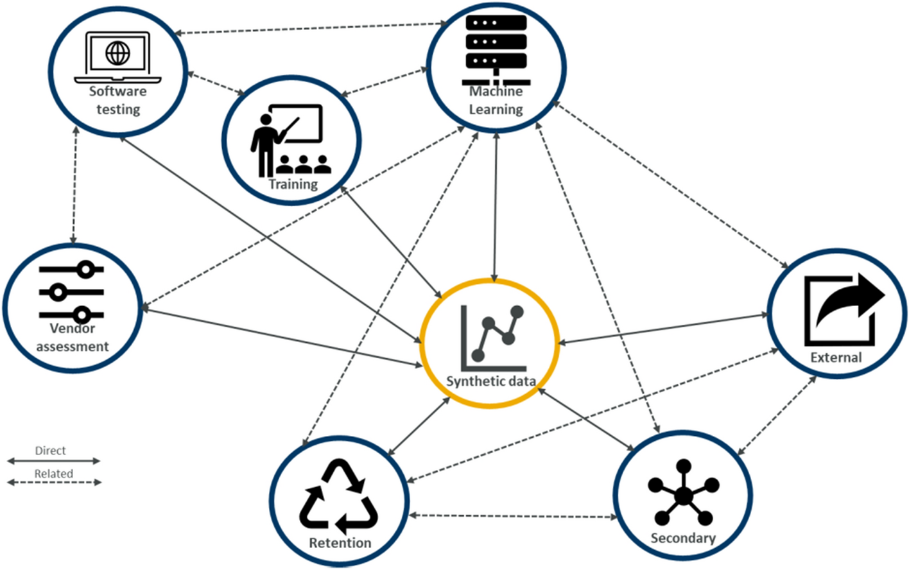

# Scaling Machine Learning Systems with Synthetic Data #

- Wouldn't it be great to have access to large pool of quality data to increase organizational competitiveness and innovations using AI?

- What if you can improve utility of data by sharing it with  business partners and governement without privacy concerns while improving collaboration and building trust?

- What if you monitize on new products and services by synthesizing real time customer data without compromising personal information? 

- The answer to questions above is Synthetic data, a method to statistically generate artificial data using simulations to meet specific needs while improving data utility for improved data parivacy and protection.

 
 
 
  
 
 
 

The benefits of implementing AI in finance is monumnetal from chatbot assistants to fraud detection and task automation help streamline processes and therefore vastly improve customer experience. Aggregated potential cost savings for banks from AI applications is estimated at [$447 billion by 2023](https://www.businessinsider.com/ai-in-banking-report?r=US&IR=T) combined in front and back office.

The benefits in Financial Services is increasingly underpinned by technological advances in AI and Machine Learning, big data and cloud infrastructure. According to the [Global Survey on AI in Financial Services](https://www.jbs.cam.ac.uk/faculty-research/centres/alternative-finance/publications/transforming-paradigms/), 77% of respondents believe AI will be of high or very high overall relevance to their organisations playing a key role in product development and revenue creation, process automation, risk management, effective customer support and client acquisition. In all deployment use cases, the respondents noted that the Machine Learning and AI's biggest impact will yield from greater accuracy of model and scalability of the AI model.

Despite the growth of AI, there are considerable barriers to overcome. Quality of data train model is seen as the biggest hurdle in AI implementation in addition to the sub issues including data collection and data imbalance. Data confidentiality and data regulation is also seen as causing bottleneck situation to AI implementation limiting utility of data. Often organisations have to put in extra resources on time consuming activities such as data wrangling. Nearly [83% of respondents](https://www.jbs.cam.ac.uk/faculty-research/centres/alternative-finance/publications/transforming-paradigms/) perceive the regulation around sharing personal information or data between jurisdiction to be significnatly problematic for the implementation of AI. 

The above has hilighted urgency in need to optimize data utility and share data using innovative privacy enhancing technologies to prevent data sharing concerns. 

## What is synthetic data?

  
    figure1: Synthetic data use: exploring use cases to optimise data utility  <a href="https://link.springer.com/article/10.1007/s44163-021-00016-y">Ref: Synthetic data use [3]</a>  

Synthetic data is 

## Examples

Think of clicinal trial management which would require a large cohort size from a wide range of demography and rigourous trials prior to scientific and medical acceptance. This process can be time consuming and legnthy as it will require both volume and variety of both clinical and real world data to conduct thorough statistical analysis. In addition to that hidden knowledge within the data collected adds further challenges. 

## What is synthetic data and how is it used in finance?

## Methods of generating sysnthetic data

Methods to use to produce synthetic dataset and availability matrics to ensure robust quality of generated datasets. 

## How Synthetic data is used in finance?

Think of clicinal trial management which would require a large cohort size from a wide range of demography and rigourous trials prior to scientific and medical acceptance. This process can be time consuming and legnthy as it will require both volume and variety of both clinical and real world data to conduct thorough statistical analysis. In addition to that hidden knowledge within the data collected adds further challenges. 

Across industries there are several use cases where synthetic data has proven to be an advantage. How 

As internet continues to grow in complexity and size with cloud computing and IoTs, network traffic anomalies are becoming diverse and quite common adding significant pressure to the security. Differenciating "normal" traffic behaviour from intential or unintential attack, fault or defect 

Security - Regulation, Anonymity, 

For examle Machine Learning algorithms are often used in fraud detection systems to classify legitimacy of financial transactions. 

Scarcity of fraudulent instances makes the dataset used to train such models highly imbalance. 

The value for business: Security, Agility, Scale, Reproducibility

innovation : security, Agility and scale

regulatory compliance : security, reproducibility, scale

- humans at center
- technology at speed
- innovating at scale

Refs:
[A BasisEvolution framework for network traffic anomaly detection](https://www.sciencedirect.com/science/article/abs/pii/S1389128618300331)

[Money Laundering Detection using Synthetic Dat](https://www.diva-portal.org/smash/get/diva2:834701/FULLTEXT01.pdf)

[A Copula based Framework for Generating Synthetic Data from Aggregated Sources](https://ieeexplore.ieee.org/abstract/document/9346329)

[Synthetic data use: Medical trial example](https://link.springer.com/article/10.1007/s44163-021-00016-y)
