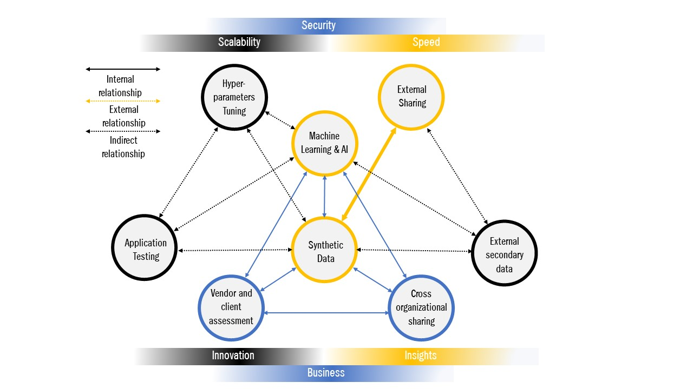
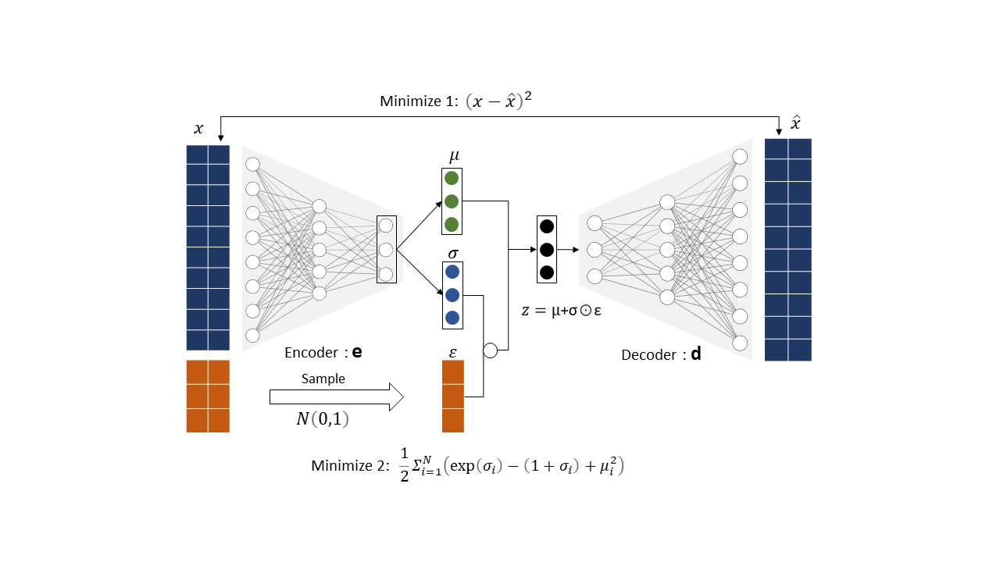
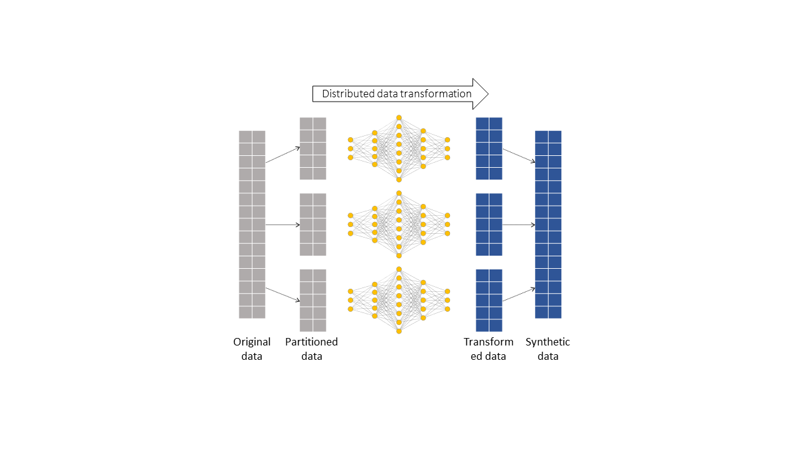

# Scaling Machine Learning Systems with Synthetic Data #

- Wouldn't it be great to have access to large pool of quality data to increase organizational competitiveness and innovations using AI?

- What if you can improve utility of data by sharing it with  trusted business partners and governement without privacy concerns while improving collaboration and building trust?

- What if you monitize on new products and services by synthesizing real time customer data without compromising privacy information? 

- The answer to questions above is Synthetic Data, a method to statistically generate artificial data using simulations to meet specific organizational needs while improving data utility for improved data parivacy and protection.

 
 
 
  
 
 
 

The benefits of implementing AI in finance is monumnetal. From natural language understanding to chatbots,  and intelligence automation to fraud detection has helped streamline processes and therefore vastly improve customer experience. By 2023, a potential cost saving of [$447 billion](https://www.businessinsider.com/ai-in-banking-report?r=US&IR=T) is estimated in banking alone from AI applications.

The benefits to Financial Services is increasingly underpinned by technological advances in AI and Machine Learning, big data and cloud infrastructure. According to the [Global Survey on AI in Financial Services](https://www.jbs.cam.ac.uk/faculty-research/centres/alternative-finance/publications/transforming-paradigms/), 77% of respondents believe AI will be of high or very high overall relevance to their organisations playing key role in revenue creation by customer support and client acquisitions, risk management, process automation, and product development. In all deployment use cases, the respondents noted that the Machine Learning and AI's biggest impact will yield from greater model accuracy and scalability.

Despite the growth of AI, there are considerable barriers to overcome. Quality of data to train model is seen as the biggest hurdle in AI implementation in addition to sub issues including data collection and data imbalance. Data confidentiality and data privacy is also mildly perceived as causing bottleneck situation to AI implementation limiting utility of data. Often organisations have to put in extra resources on time consuming activities such as data cleaning. Nearly [83% of respondents](https://www.jbs.cam.ac.uk/faculty-research/centres/alternative-finance/publications/transforming-paradigms/) believe that regulation around cross-organisational data sharing of personal information between jurisdiction to be significnatly problematic for AI implementation. 

The above has hilighted urgency in need to optimize data utility and share data using innovative privacy enhancing technologies to prevent data sharing concerns. 

## What is synthetic data?

**Synthetic data** is created artificially, by mimicking mathematical properties such as statistical distribution, probability distribution of the real-world data. It is a form of data augmentation practice to generate balanced datasets. Synthetic data is used across a wide range of industries including financial services, government,  pharma, medical, and media and entertainment. The concept of augmenting data is widely used across a variety of industries to imitate real-world scenarios. In ML/AI context it has an important use case in training, validating, evaluating ML applications, for scaling up new services and products with speed and accuracy. 

Synthetic data is a privacy-enhancing technology and can be seen as a potential solution to financial services strugglig with privacy compliance and data access. A [study published by Gartner](https://www.gartner.com/en/doc/100-data-and-analytics-predictions-through-2025) predicts that by 2024, 60% of the data used for the development of AI and analytics solutions will be synthetically generated. Gartner is ranking Synthetic data as a [forward-looking privacy technology](https://www.gartner.com/document/3987903). MIT Technology Review describes Synthetic data as one of the [10 Breakthrough Technologies, 2022](https://www.technologyreview.com/2022/02/23/1045416/10-breakthrough-technologies-2022/#synthetic-data-for-ai).

  

  
  <figcaption> figure1: Synthetic data use: Optimising data utility</figcaption>

  

## Machine learning applications and reproducibility

The accuracy and performance matrices generated by ML models depend heavily on statistical relationship between the input data. Often methods used in data aggregation coupled with sampling size and random noise can distort this relationship between the variables resulting in poor performance, which may erode trust in processes.

A [research by Gartner](https://www.gartner.com/en/newsroom/press-releases/2018-02-13-gartner-says-nearly-half-of-cios-are-planning-to-deploy-artificial-intelligence) estimates that 85% of algorithms that are currently being used are erroneous due to inherent biases within datasets. Synthetic data in addition to replica dataset can help mitigate bias and imbalance in dataset.

Reproducibility is yet an important principle in scientific method used for validation process. An outcome of an ML model is reliable if one can fully reproduce the exact result. This is critical in order to develop algorithms to reliably solve complex tasks at scale, with limited or no human supervision [2]. In research intensive industries use of synthetic data has helped researchers not only in dealing with issues around sampling size and data imbalance but also improve the reproducibility and predictive performance of AI models by ensuring complete sepeartion of training and evaluation datasets [3].

For example in cyber security,  Intrusion Detection Systems(IDS) is widely used to quickly detect anomalies in computer network and produce timely response to a potential cyber attack. ML/AI algorithms are used at the core of such system. The algorithm uses multiclass classification and clustering techniques, to find anomalies in attacker's behaviour and differenciate unusual pattern from the normal one. Such data on past attacks is rarely shared outside organisational boundries due to privacy and reputational concerns. Therefore, lack of training data makes it nearlly impossible to train IDS such that it detects unforeseen future events and edge-cases. Furthermore, an algorithm trained on such statistically imbalanced dataset often risk generating higher false negatives.

A research experiement in IDS shows that synthetic data samples generated using sophisticated technique such as Conditional Generative Adversarial Network (CTGAN) can balance training samples, using both actuals and a wide range of simulations, can increase prediction accuracy by as much as 8% [4].

## External Sharing

Financial data - such as consumer transaction records, account payments, claims and underwritings is highly sensitive and subject to stringent data protection obligations and data privacy laws [5]. On the otherhand, Synthetic data lacks sensitive or personal information about real people. Especially important in financial services, where confidentiality of client data is extremely delicate, and leaks could lead to major legal and financial issues. For example, in 2014, a data breach at JP Morgan impacted 76 million users and was estimated to cost $100 million in fines for the company. 

_To add privacy preserving features_

Synthetic data overcomes this issue by generating an artificial dataset without disclosing confidential information from the original dataset. Counter intuitively however, sharing Synthetic data can add a great deal of benefits to financial services. This includes acquiring data from third parties, sharing data with vendors, and collaborative data sharing with business partners for effective customer service. The benefit of sharing Synthetic data is not only limited to relying on third party credit report or analysing market sentiment on social media but also in effective implementation of risk management framework to speed up client onboarding process while complying with KYC/AML regulations.

The Synthetic data can be shared internally and externally without much concern.

**Operational Benefits:**

* External, Secondary data

* Vendor and client assessment

* Software testing

* Training and retention data

* Cross organizational sharing

* Synthetic data properties

* Advantages

## How can you generate synthetic data?

[Model generation diagrams](https://www.statice.ai/post/how-generate-synthetic-data)

Data augmentation is used for creating balanced data to train, validate and evaluate models covering a wide range of use-cases and unforeseen events. For instance,  Convolutional Neural Networks (CNN) or Generative Adversarial Networks (GANs) can be utilised to produce augmented synthetic images and videos. Whereas in structured data sequences can be generated dynamically using causation and correlation patterns found in real-time dataset(Das A., 2020), (Dilmegani C., 2021).

Synthetic environments for scenario planning is an increasingly popular choice in reinforcement learning applications. Synthetic data generated using [Reingforcement Learning](https://en.wikipedia.org/wiki/Reinforcement_learning) can simulate scenarios that have never been seen before. For instance toolkits such as OpenAI Gym –providing simulation environments to compare and develop unprecedented scenarios and edge-cases in both single and multi-agent context (Gulli, Kapoor & Pal, 2019).

### Variation AutoEncoder and Decoder:

### GAN

### Divide & Conquer 

[Generating Synthetic data 1](https://research.aimultiple.com/synthetic-data-generation/)

[Generating synthetic data 2](https://research.aimultiple.com/synthetic-data-generation/)

## Use cases

## Insurance Usecase
**Insurance companies** are compelled to make most out of data they collect from users as a result of digitisation, intense competition and a new set of emerging risks. However, their ability to do so is constrained by strictest privacy concerns, regulations, and legacy technology. Furthermore, regulatory developments such as [proposal to regulate AI systems](https://digital-strategy.ec.europa.eu/en/library/proposal-regulation-laying-down-harmonised-rules-artificial-intelligence) ,released by European Commission require, require fast adpting from insurance players. Synthetic data can help insurers address some of their data processing challenges.

_"Most tabular customer data in the insurance field can be synthesized, including claim data, sales and churn data, as well as market and survey data. It’s an opportunity to identify, develop, and test new products that answer customers’ needs from data that complies with the strictest privacy and legal frameworks"_

* Product Development: While complying with the strictest privacy framework, organisations can use synthetic data to identify, develop and test new products
* Sales: With synthetic data it is possible to share real-time information across organisation or jurisdiction with secure exchange aiding to improvement in customer journey and so boosting customer conversion rate. 
* 
 

## Financial usecase

## Health usecase

Refs:
[A BasisEvolution framework for network traffic anomaly detection](https://www.sciencedirect.com/science/article/abs/pii/S1389128618300331)

[Money Laundering Detection using Synthetic Dat](https://www.diva-portal.org/smash/get/diva2:834701/FULLTEXT01.pdf)

[A Copula based Framework for Generating Synthetic Data from Aggregated Sources](https://ieeexplore.ieee.org/abstract/document/9346329)

[2] [Reproducibility in Machine Learning for Health](https://openreview.net/pdf?id=HylgS2IpLN)

[3] [Synthetic data use: Medical trial example](https://link.springer.com/article/10.1007/s44163-021-00016-y)

[4] [Effect of balancing data using synthetic data on the performance of machine learning classifiers for Intrusion Detection in Computer Networks](https://arxiv.org/pdf/2204.00144.pdf)

[5] [Synthetic data to support financial services innovation](https://www.fca.org.uk/publication/call-for-input/synthetic-data-to-support-financial-services-innovation.pdf)